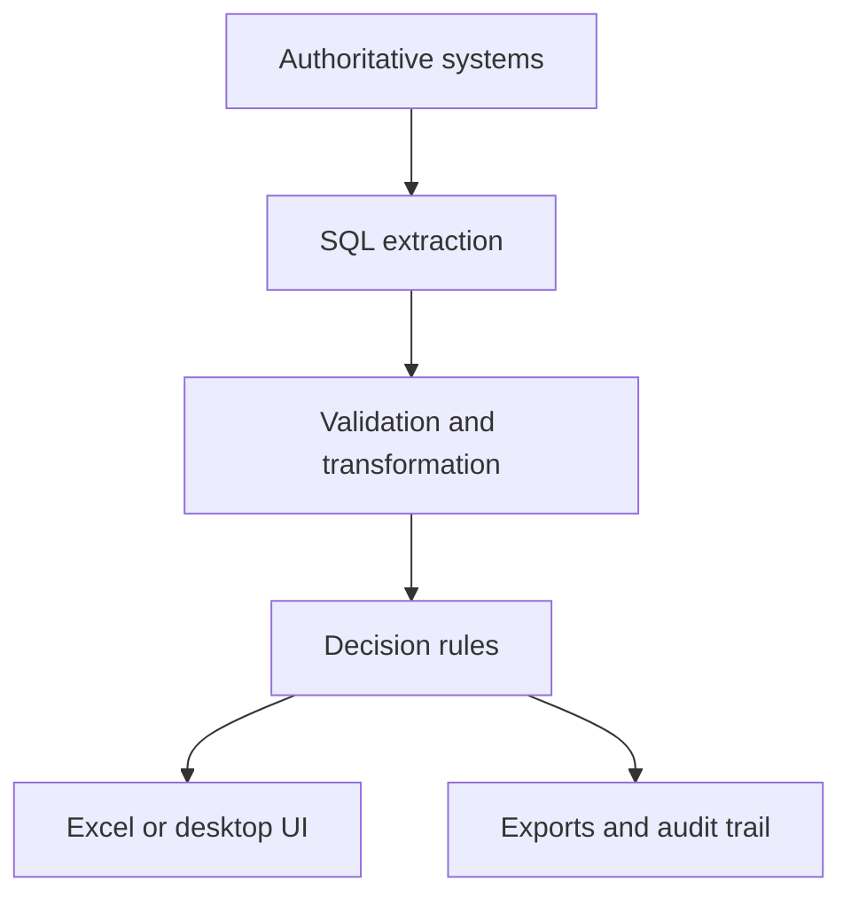
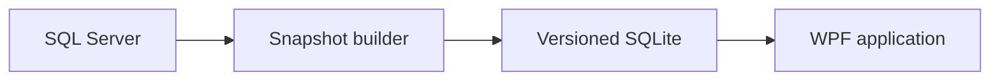

# Architecture Patterns

Across the portfolio, the same separation of concerns appears repeatedly.

## 1. Source-first performance

Large filters and aggregations belong close to the database when possible. In one pricing workflow, this changed the user experience from a minutes-long refresh to an interactive response measured in seconds.

## 2. Explicit decision layers

Source fields are not the same thing as business decisions. Each tool separates:

- raw source values;
- normalized units and categories;
- eligibility rules;
- ranking or allocation rules;
- warnings and overrides;
- user-facing output.

## 3. Offline distribution

When some users cannot reach the source database, a centrally generated SQLite snapshot can provide the same query model to connected and offline users:

## 4. Validation against outcomes

Calculated yield or eligibility is compared with actual production results. Results are classified as exact, conservative, or overstated. Missing measurements remain potential candidates for review rather than becoming false failures.
