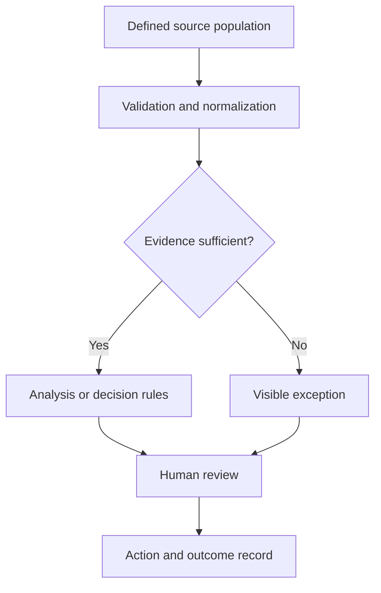

# Architecture & Decision Controls

The examples below separate observed implementation from design principles. They are generalized descriptions, not employer blueprints.

| Pattern | Reviewed evidence | Boundary |
|---|---|---|
| Source → transformation → review | Inventory SQL/Power Query preparation and classifications | Final allocation remains a planner decision |
| Connected and offline use | Price Explorer data coordinator and compressed JSON cache | Snapshot age and Windows stability still matter |
| Workflow automation | Production calculations and document preparation in Excel/VBA | Original formulas/templates are excluded |
| Compatibility before similarity | Routing foundation and classification roadmap | Similarity/recommendations remain planned |
| Capacity scenario comparison | Runnable synthetic Python model | Aggregate load does not establish a feasible schedule |

## A reviewable decision system

This diagram is a generalized design principle. It is not a statement that every project has implemented an outcome-recording loop.

## Implementation corrections

The inspected Price Explorer cache uses compressed JSON, not SQLite. The previous minutes-to-seconds performance assertion lacked a reviewed benchmark and is removed. Query optimization is a development approach; measured speed improvement needs a repeatable before/after test.

[Portfolio home](../README.md)
