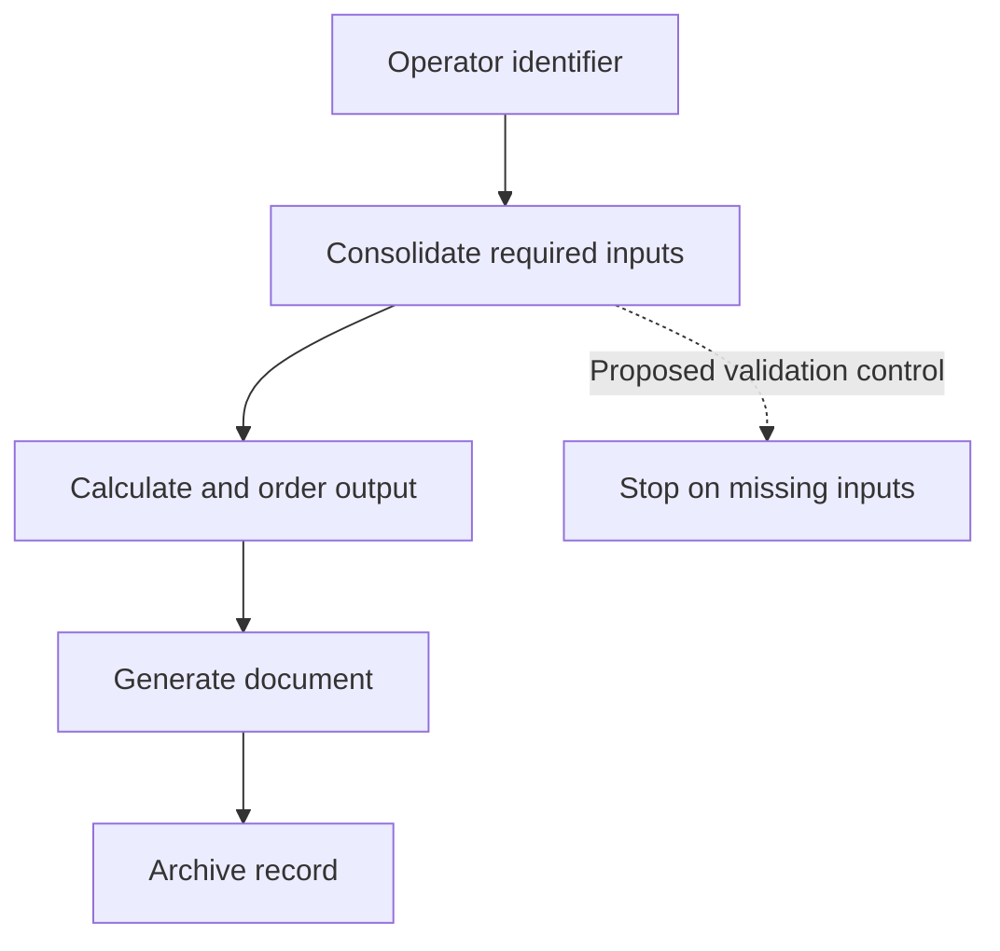

# Production Document Automation

**Implemented workflow documented in career sources | Excel / VBA**

## Executive summary

I automated a production calculation and reporting workflow that required repeated lookups and manual data entry. The workflow consolidates information, performs calculations, sorts results, and generates and archives a document. Career documentation reports reduced preparation effort; no internal document or exact time saving is published.

## Business problem

Preparing each document required information from several engineering sources. Repeating lookups and calculations consumed time and created opportunities for transcription and version errors.

## Operational context

The output supports a production workflow and must remain consistent enough for downstream use. Automation has value when it fits the operator action and preserves the required record.

## My ownership

Developed the Excel/VBA calculation and reporting automation. The career resume supports consolidation and reduced manual effort; the existing project description documents the print/archive workflow. No claim is made that I authored the underlying engineering requirements.

## Data and constraints

Input identifiers, engineering source material, calculations, dimensions, document templates, and archive locations are withheld. The public representation describes responsibilities between steps without revealing the production calculation.

## Approach

Consolidated the required lookups, calculations, and ordering into one workbook workflow. Connected document generation and archiving to the operator action so repeated preparation did not require repeating the manual sequence.

## Domain reasoning

An automated report must preserve the production meaning of its inputs and the order of its output. Saving clicks is insufficient if the operator cannot connect the document to the intended job or if an outdated result is reused.

## Solution

An identifier-and-print workflow that assembles the production document consistently. Original workbook code and templates remain excluded.

## Implementation

Career sources describe the process as automated and report reduced manual effort per unit. Deployment dates, user count, and a formal acceptance log are not available in the reviewed sources.

## Results

Reduced manual lookup and data-entry effort and improved reporting consistency. Reduced error risk is a design benefit, not a measured defect-rate claim. Exact timing evidence stays private pending disclosure approval.

## Technology

Excel and VBA. Broader SQL and Power Query experience is documented elsewhere; the reviewed evidence does not establish the exact connector used for every lookup in this workflow.

## Visual evidence

A generalized workflow with a proposed validation checkpoint, explicitly distinguished from verified production implementation.

## What this demonstrates

**Domain proof:** document preparation embedded in production. **Technical proof:** Excel/VBA workflow automation. **Business-impact proof:** documented reduction in manual effort and more consistent reporting; no published benchmark or error reduction percentage.

## Resume bullets

- Automated production calculation and reporting in Excel/VBA by consolidating engineering-source lookups and reducing repeated manual data entry.
- Standardized production-document preparation through a repeatable calculation, sorting, generation, and archiving workflow.

## STAR interview story

**Situation:** Repeated engineering lookups and manual preparation slowed a production-document task. **Task:** Make preparation repeatable and easier to execute. **Action:** Consolidated lookup and calculation work into Excel/VBA and connected the output to document generation and archiving. **Result:** Career documentation reports less manual effort and more consistent reports; exact timing remains private.

[Portfolio home](../../README.md) · [Evidence standards](../../docs/data-and-confidentiality.md)
