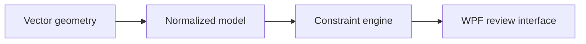

# Geometry Nesting Application

## Portfolio-safe overview

This active C#/.NET 8 WPF project converts measured 2D geometry into operator-reviewable placement recommendations. The public description is intentionally limited because the production rules and source drawings are employer-owned.

## Transferable technical work

- Parse and normalize vector geometry from an interchange file.
- Separate geometry, business rules, optimization, and presentation layers.
- Apply configurable boundary, exclusion, clearance, and orientation constraints.
- Visualize source geometry and recommendations in a desktop interface.
- Distinguish warnings that require review from invalid layouts that must stop.
- Package the Windows application for users without a development environment.

## Status

Active development. No production drawings, dimensional rules, material specifications, source code, or internal data are published here.

