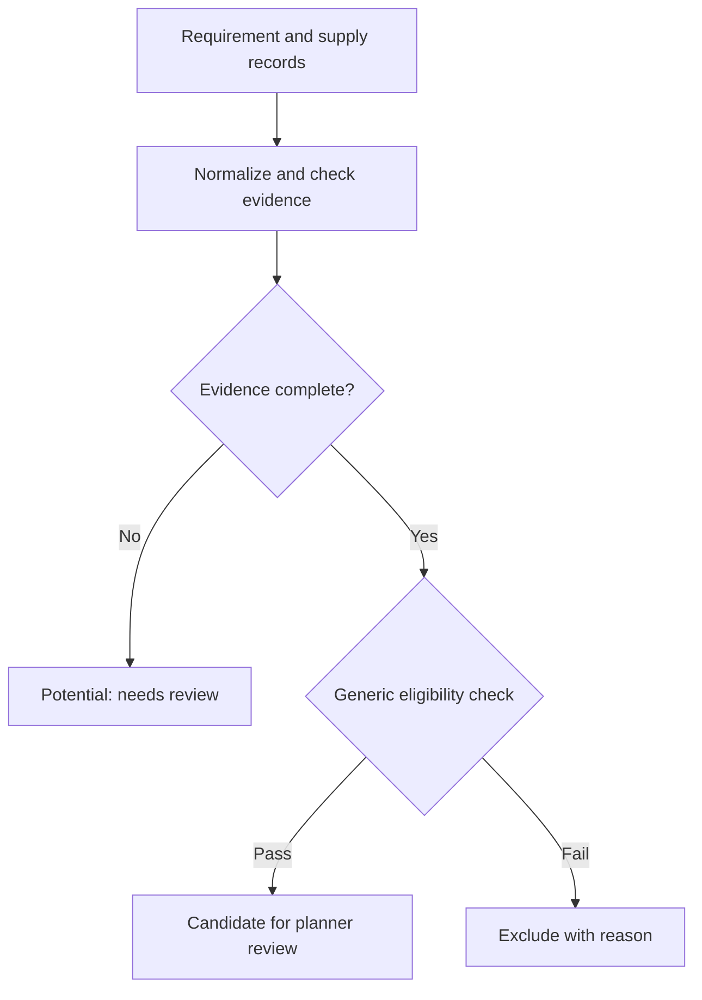

# Specialty Material Inventory Decision Support

**Working dashboard / validation phase | SQL Server, Power Query, Excel, VBA**

## Executive summary

I built an inventory decision-support dashboard that consolidates fragmented material sources and evaluates candidates against demand requirements. Implemented matching and review categories make the search repeatable while preserving uncertainty. Upstream qualification and broader validation remain unfinished; no realized inventory savings are claimed.

## Business problem

Planners had to search multiple inventory sources and interpret measurements manually. Usable material could be overlooked, while incomplete measurements could be mistaken for a clear pass or failure.

## Operational context

Finished inventory, reusable stock, and upstream material differ in readiness and evidence quality. A record existing in inventory does not prove it is eligible for a particular requirement.

## My ownership

Developed the dashboard, query migration, data-model preparation, matching calculations, and result presentation. Engineering eligibility and final material disposition remain review decisions; the portfolio does not claim automated production authorization.

## Data and constraints

The source combines demand requirements with measured material records. Public evidence excludes measurements, material formulas, inventory quantities, internal identifiers, and qualification thresholds.

## Approach

Migrated the source queries to Power Query, checked row counts and duplicates, established a consistent specification view, and implemented usable, potential, and failed classifications. Built bounded result tables with counts so users can distinguish a short display from the complete result population.

## Domain reasoning

Material readiness and measurement completeness are different questions. Missing evidence must remain visible for review. Normalizing units and measurement meaning precedes eligibility checks; a matching identifier alone is insufficient. Candidate generation must remain separate from allocating material to a real order.

## Solution

An Excel dashboard with a requirement panel, consolidated inventory candidates, explicit classification, and counts. Finished and reusable-stock matching are implemented. Upstream eligibility refinement, manual search, and naming/requirements standardization remain in progress.

## Implementation

The source records query migration, duplicate checks, row-count validation, dashboard layout, and implemented result tables. The working dashboard is in validation; this portfolio does not treat those construction checks as a completed production acceptance test.

## Results

Implemented a repeatable search and classification workflow. Broader accuracy, search-time improvement, utilization gains, and realized savings are not yet measured in the reviewed evidence.

## Technology

SQL Server, Power Query, Excel, VBA. No employer queries, formulas, or workbooks are distributed here.

## Visual evidence

Generalized review flow; this diagram represents the decision structure, not proprietary qualification rules.

## What this demonstrates

**Domain proof:** material suitability, uncertainty, and planner authority. **Technical proof:** SQL/Power Query integration, validation, and Excel decision logic. **Business-impact proof:** working workflow; quantified operational benefit remains unverified.

## Resume bullets

- Built a SQL Server/Power Query inventory dashboard that consolidates multiple supply sources and separates eligible candidates from records requiring further review.
- Migrated inventory queries, validated row counts and duplicates, and implemented bounded results with total-match counts to make material searches more consistent.

## STAR interview story

**Situation:** Inventory evaluation depended on separate searches and manual interpretation. **Task:** Provide a repeatable view without hiding uncertainty. **Action:** Consolidated sources, normalized requirements, implemented classification and bounded outputs, and performed data checks. **Result:** A working dashboard in validation; upstream qualification remains under refinement.

[Portfolio home](../../README.md) · [Evidence standards](../../docs/data-and-confidentiality.md)
