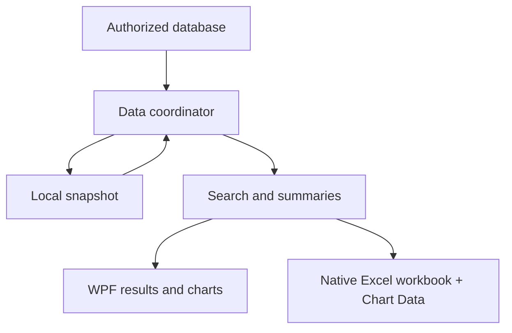

# Manufacturing Price Explorer

**Validated 0.2.8 Windows milestone; active product development | C# / WPF / SQL Server**

## Executive summary

I am developing a desktop application for researching comparable historical transactions and producing reviewable summaries and exports. The implementation includes connected refresh and a local snapshot path for offline use. The earlier post-search freeze/crash was root-caused and fixed, and the current 0.2.8 Excel-export milestone has now been manually verified on Windows.

## Business problem

Commercial analysis required navigating detailed transaction history and determining which records were meaningfully comparable. Some intended users also lack direct database connectivity, making distribution part of the analytical problem.

## Operational context

An observed transaction is evidence about a past sale, not a recommended future price. Comparability depends on authorized criteria, and quantity and timing affect interpretation. Historical values must retain their meaning through filtering, summarization, and export.

## My ownership

Own the project requirements and development direction across its workbook origins and desktop implementation, including search behavior, analytical outputs, export behavior, and distribution constraints. Current repository code supports the desktop architecture; this portfolio describes verified milestones precisely rather than treating the presence of code as production acceptance.

## Data and constraints

The production application uses actual historical records only. The public portfolio contains no customer names, prices, transaction history, product specifications, classification mappings, connection strings, or source code. Any future public demonstration must use independently generated fictional records and be labeled as a demonstration.

## Approach

Separated source loading, local snapshot handling, search logic, presentation, chart rendering, and Excel export. The reviewed implementation can load cached data before attempting refresh and preserve cached use when refresh fails. A timestamp accompanies the loaded data so freshness can be considered.

Diagnostic logging was used to isolate two failures that initially appeared to be UI hangs. Both traced to unsupported/custom geometry reaching display/export formatting paths after search results had already been generated. The fixes now guard those paths and display safe fallback text instead of throwing.

## Domain reasoning

A summary should describe its selected population, not imply a universal market price. Weighting and transaction counts matter when comparing histories. Offline availability is useful only when users can recognize the age of the data. Charts and exports must retain the analytical context of the search.

## Solution

A C#/.NET WPF interface with comparable-history research, summary statistics, charts, Excel export, and import/export of local data snapshots. The inspected cache implementation uses compressed JSON; earlier portfolio references to SQLite were inaccurate.

The Excel export now uses native Excel scatter charts backed by a visible `Chart Data` worksheet rather than inserting static chart images. This preserves native Excel hover/tool-tip behavior and makes the plotted source values auditable in the workbook.

## Implementation and validation

Self-contained Windows packaging is documented for users without a local .NET installation.

The current validated build is **0.2.8 Excel Export Test 1**. Manual Windows verification confirmed that the previously failing export scenario completes, the workbook opens, the native charts function, and chart-point hover information is available. Persistent chart data labels are not currently shown; that is an enhancement opportunity rather than a failure of the accepted hover requirement.

The earlier Leonardo/customer-search crash path had already been resolved in the 0.2.6 line. The 0.2.8 milestone closes the separate custom-geometry failure encountered while building the Excel Transactions sheet.

This validation does not imply that every future feature or deployment scenario is complete. Broader rollout, user adoption, and future enhancements remain separate milestones.

## Results

The repository now provides implementation and manual-acceptance evidence for search, caching, charts, and Excel exports through the 0.2.8 milestone. The prior search/export crash paths described in the production handoff are resolved in the tested build.

No realized commercial savings or unsupported performance benchmark is claimed here. Search diagnostics demonstrated that the previously observed Leonardo failure was not a raw-data-volume problem; the root causes were display/export handling of unsupported geometry.

## Technology

C#, .NET 8, WPF, SQL Server access, compressed JSON snapshots, native Excel chart export, and Excel workbook generation. Earlier work used Excel, Power Query, and VBA. No database infrastructure or proprietary formulas are reproduced.

## Visual evidence

Generalized data and presentation architecture, checked against the source responsibilities.

## What this demonstrates

**Domain proof:** comparable-history interpretation and commercial workflow constraints. **Technical proof:** desktop analytics, persistence, debugging, native Excel exports, and self-contained distribution. **Business-impact proof:** a working, manually validated analytical tool milestone; realized financial benefit or enterprise-wide deployment is not claimed.

## Resume bullets

- Developed and manually validated a C#/.NET WPF historical-transaction research tool with reviewable summaries, native Excel charts, and auditable export data for commercial decision support.
- Diagnosed and resolved post-search/export crashes by tracing unsupported geometry through WPF display and Excel-export paths, adding safe handling and regression coverage rather than treating the failures as data-volume performance problems.
- Implemented connected refresh and local snapshot handling to support analysis when direct source access is unavailable.

## STAR interview story

**Situation:** Users needed comparable historical research, including use without direct database access, and the desktop tool later showed intermittent-looking freezes around specific customer/export workflows. **Task:** Deliver a reviewable analytical workflow and make the failing paths deterministic enough to fix safely. **Action:** Developed separated data, search, chart, export and snapshot responsibilities; added diagnostics; traced the failures to unsupported/custom geometry being evaluated in UI/export display paths; guarded those paths and added regression coverage. **Result:** The 0.2.8 Windows export scenario was manually verified working, including native Excel charts and useful hover information. Discuss the verified milestone without claiming unmeasured commercial savings or universal deployment.

[Portfolio home](../../README.md) · [Evidence standards](../../docs/data-and-confidentiality.md)
