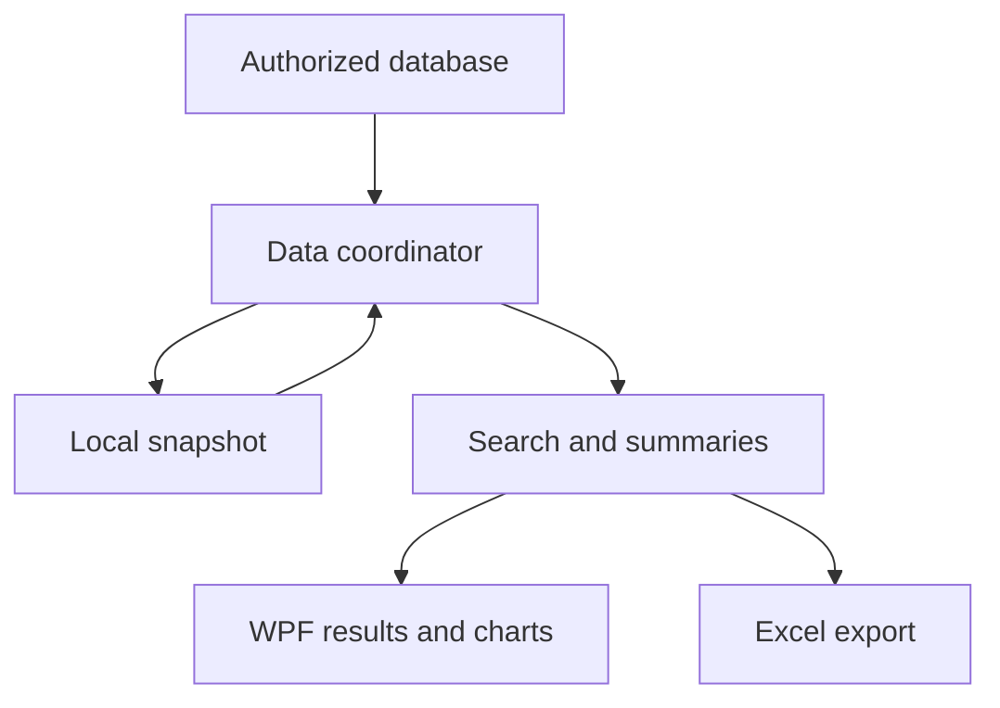

# Manufacturing Price Explorer

**Active development; Windows stability acceptance pending | C# / WPF / SQL Server**

## Executive summary

I am developing a desktop application for researching comparable historical transactions and producing reviewable summaries and exports. The implementation includes connected refresh and a local snapshot path for offline use. A reported search-to-chart freeze remains a release gate until the fix passes repeated Windows navigation testing.

## Business problem

Commercial analysis required navigating detailed transaction history and determining which records were meaningfully comparable. Some intended users also lack direct database connectivity, making distribution part of the analytical problem.

## Operational context

An observed transaction is evidence about a past sale, not a recommended future price. Comparability depends on authorized criteria, and quantity and timing affect interpretation. Historical values must retain their meaning through filtering, summarization, and export.

## My ownership

Own the project requirements and development direction across its workbook origins and desktop implementation, including search behavior, analytical outputs, and distribution constraints. Current repository code supports the desktop architecture; successful production acceptance is not inferred from the presence of code.

## Data and constraints

The production application uses actual historical records only. The public portfolio contains no customer names, prices, transaction history, product specifications, classification mappings, connection strings, or source code. Any future public demonstration must use independently generated fictional records and be labeled as a demonstration.

## Approach

Separated source loading, local snapshot handling, search logic, presentation, chart rendering, and Excel export. The reviewed implementation can load cached data before attempting refresh and preserve cached use when refresh fails. A timestamp accompanies the loaded data so freshness can be considered.

## Domain reasoning

A summary should describe its selected population, not imply a universal market price. Weighting and transaction counts matter when comparing histories. Offline availability is useful only when users can recognize the age of the data. Charts and exports must retain the analytical context of the search.

## Solution

A C#/.NET WPF interface with comparable-history research, summary statistics, charts, Excel export, and import/export of local data snapshots. The inspected cache implementation uses compressed JSON; earlier portfolio references to SQLite were inaccurate.

## Implementation

Self-contained Windows packaging is documented for users without a local .NET installation. This environment cannot exercise the Windows UI or the authorized operational dataset. The previously implemented fix needs the uninterrupted search/second-search/chart regression before release acceptance.

## Results

The repository provides implementation evidence for search, caching, charts, and exports. No verified speed benchmark, realized commercial benefit, or stable-release claim is made. A successful build or unit-test result would not alone resolve the reported UI freeze.

## Technology

C#, .NET 8, WPF, SQL Server access, compressed JSON snapshots, and Excel export. Earlier work used Excel, Power Query, and VBA. No database infrastructure or proprietary formulas are reproduced.

## Visual evidence

Generalized data and presentation architecture, checked against the source responsibilities.

## What this demonstrates

**Domain proof:** comparable-history interpretation and commercial workflow constraints. **Technical proof:** desktop analytics, persistence, exports, and distribution. **Business-impact proof:** active tool development; operational stability and measured benefit remain pending.

## Resume bullets

- Developing a C#/.NET WPF historical-transaction research tool with reviewable summaries, charts, and Excel exports for commercial decision support.
- Implemented connected refresh and local snapshot handling to support analysis when direct source access is unavailable; Windows workflow acceptance remains in progress.

## STAR interview story

**Situation:** Users needed comparable historical research, including use without direct database access. **Task:** Deliver a reviewable analytical workflow with practical distribution. **Action:** Developed separated data, search, chart, and export responsibilities plus local snapshots. **Result:** Implemented desktop functionality; a reported search-to-chart freeze is still an acceptance gate. Discuss this as active engineering work, not a completed business-impact story.

[Portfolio home](../../README.md) · [Evidence standards](../../docs/data-and-confidentiality.md)
