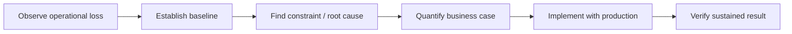

# Manufacturing Process Improvement — From Constraint to Measured Result

## Executive summary

Across six years in a dedicated Lean/continuous-improvement role, I led and facilitated manufacturing improvements that addressed quality defects, equipment utilization, operator motion, material flow, and facility layout. The common pattern was to turn a shop-floor problem into a measurable baseline, quantify the economic or operating effect, implement the change with production stakeholders, and verify the result after the process changed.

This case study combines several completed projects because together they show the capability more clearly than a collection of isolated Lean-event summaries.

## Business problem

Manufacturing losses rarely appear in one clean dataset. They show up as rework, waiting, excess motion, poorly loaded equipment, recurring quality escapes, avoidable handling, and layouts that force the process to work around the facility rather than the facility to support the process.

The challenge was not simply identifying waste. It was determining which losses were economically meaningful, finding the process conditions driving them, and implementing changes that production could sustain.

## Operational context

The work was performed in large industrial-motor manufacturing and included hands-on production processes, quality requirements, material movement, heat-treatment operations, assembly, and facility-flow decisions. I had prior shop-floor experience in receiving and motor winding before moving into Lean, which let me evaluate proposed changes against how the work was actually performed.

## My ownership

My responsibilities included:

- Leading a Six Sigma Green Belt improvement project
- Collecting and analyzing process data
- Building cost/benefit cases for improvement opportunities
- Facilitating recurring Lean and Kaizen events
- Working with operators, manufacturing leadership, quality, engineering, and material functions
- Designing or supporting revised material-flow and point-of-use approaches
- Supporting manufacturing-layout implementation using Lean Flex Flow principles
- Verifying that changes addressed the original constraint rather than merely moving the problem elsewhere

## Data and constraints

The original project records include internal cost, cycle-time, quality, travel, utilization, and production information. Those source artifacts are not published here.

This portfolio therefore preserves the verified analytical method and business outcomes while withholding employer-sensitive source data and exact internal calculations until disclosure is explicitly approved.

## Approach

### 1. Define the loss in operational terms

I translated broad complaints such as “too much rework,” “operators spend too long gathering hardware,” or “the oven is expensive to run” into measurable process questions.

### 2. Establish the baseline

Depending on the project, the baseline included defect/rework behavior, component usage, batch loading, operator travel, cycle time, material location, or production-flow observations.

### 3. Quantify the business case

Improvement work was prioritized by the operational and financial consequence, not by how visually obvious the waste was. Cost justification was part of the recommendation rather than an afterthought.

### 4. Change the physical or operating process

Examples included point-of-use material staging, batch/loading changes, defect-reduction actions, and facility/layout improvements. The output was a changed process—not simply an analysis deck.

### 5. Validate after implementation

Results were compared with the original baseline to confirm that the change actually reduced the targeted loss.

## Domain reasoning

These projects required manufacturing judgment beyond generic data analysis:

- A lower unit cost is not an improvement if it creates a production constraint elsewhere.
- Equipment utilization must be evaluated against batch behavior and the real cost structure of operating the process.
- Point-of-use material must improve access without creating inventory-control or replenishment failures.
- Quality improvement has to address both internal rework and downstream product risk.
- Layout changes must consider material flow, operator motion, work sequence, safety, and the interactions between work centers.

## Solutions and completed results

### Six Sigma defect-reduction project

Led a Green Belt project addressing recurring finish defects on large industrial motors. The implemented changes reduced rework and downstream corrosion risk and produced documented annualized savings.

### Heat-treatment utilization

Analyzed component usage and batch quantities to improve oven loading and reduce the cost of underutilized processing. The project produced substantial documented annualized savings.

### Point-of-use hardware staging

Redesigned how assembly hardware was supplied at the point of use. The change materially reduced operator travel and assembly cycle time while producing documented annualized savings.

### Lean event facilitation

Facilitated recurring events covering 5S, one-piece flow, point-of-use tooling/material, visual management, staging, and waste elimination. This built repeatable improvement behavior rather than treating Lean as a one-time project.

### Manufacturing expansion and layout

Supported layout and implementation of a secondary manufacturing facility using Lean Flex Flow principles, applying flow and waste-reduction thinking at the system level rather than only within an individual workstation.

## Technology and methods

- Lean manufacturing
- Six Sigma / DMAIC concepts
- Root-cause analysis
- Excel-based analysis
- Cost/benefit analysis
- Process observation and measurement
- Material-flow analysis
- Kaizen facilitation
- Facility/layout improvement
- Cross-functional implementation

## Visual evidence

The original plant layouts, production records, cost worksheets, and process documentation are employer-owned and are not reproduced here.

A safe portfolio visual for this case study should be recreated from synthetic information and show the transferable pattern:

## What this demonstrates

- Manufacturing domain knowledge
- Lean / continuous improvement ownership
- Quantitative business-case development
- Ability to move from ambiguous operational problem to implementation
- Cross-functional influence without relying on formal authority
- Change management on the shop floor
- Focus on measurable cost, quality, delivery, and flow outcomes

## Resume bullets

- Led Lean and Six Sigma manufacturing improvements spanning quality, equipment utilization, point-of-use material flow, and facility layout, translating shop-floor constraints into cost-justified and implemented process changes.
- Completed a Six Sigma Green Belt defect-reduction project that reduced rework and product-risk exposure while delivering documented annualized savings.
- Analyzed heat-treatment utilization and batch behavior to redesign loading strategy, generating substantial documented annualized savings from an existing manufacturing asset.
- Redesigned point-of-use hardware staging to reduce operator travel and assembly cycle time while improving repeatability of material presentation.
- Facilitated recurring Kaizen events and supported a secondary manufacturing-facility layout using Lean Flex Flow principles.

## STAR interview source

**Situation:** Multiple manufacturing processes contained recurring losses in quality, motion, utilization, and flow.  
**Task:** Identify high-value constraints, build defensible business cases, and implement changes that production teams could sustain.  
**Action:** Established baselines, analyzed the governing process conditions, quantified the cost/opportunity, worked cross-functionally with the people performing and supporting the work, and implemented changes to the physical or operating process.  
**Result:** Reduced rework, improved equipment utilization, shortened assembly work, reduced operator motion, and delivered multiple projects with documented annualized savings.

> Exact historical savings and internal operating figures are retained in the private career evidence record and are not published here unless disclosure is explicitly approved.
