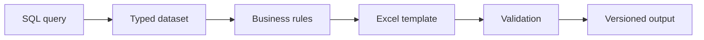

# Automated Excel Report Factory

## Problem

Many manufacturing reports repeat the same fragile workflow: export data, paste into a workbook, repair formulas, refresh pivots, rename the file, and distribute it. Every manual touch creates delay and inconsistency.

## Pattern

The report factory separates reusable responsibilities:

## Controls

- Parameterized queries instead of copied SQL strings
- Stable table and column contracts
- Refresh timestamps and row-count checks
- Named output ranges instead of hard-coded cell coordinates where practical
- Clear error messages for missing source fields
- Deterministic filenames and archive locations
- Detail tabs retained for auditability

## Technologies

SQL Server, Python, Excel 365, Power Query, VBA, and template-driven reporting.

## Why it matters

The pattern converts one-off analyst effort into a repeatable reporting product and reduces the amount of spreadsheet repair needed after source-system changes.

