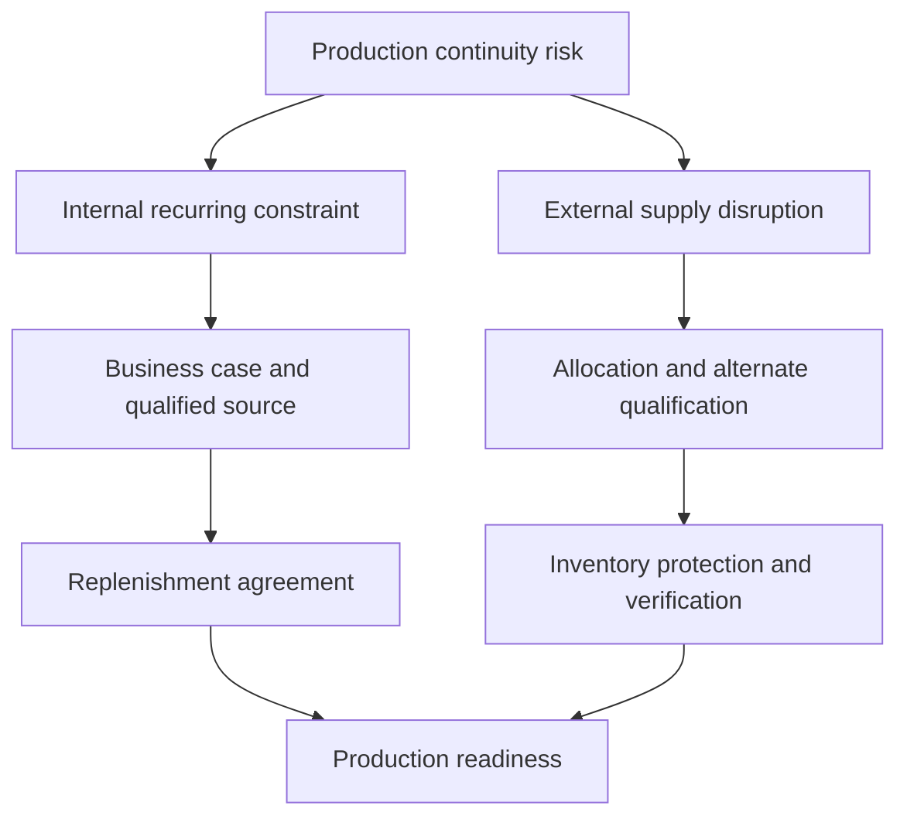

# Supply-Chain Resilience & Supplier Development

**Completed historical work | Supply planning, strategic sourcing, cross-functional implementation**

## Executive summary

I addressed two different threats to industrial-motor production: a recurring internal component bottleneck and severe external supply shortages. Supplier development and vendor-managed inventory removed the recurring constraint; coordinated allocation and qualification work protected production during disruption. The documented outcomes include lower component cost, improved delivery readiness, and maintained production continuity.

## Business problem

An internal component process repeatedly arrived too late to support assembly. Later, a global component shortage threatened continuity even when internal production was ready. Both problems required decisions about supply availability, quality, inventory, and delivery together.

## Operational context

As Buyer/Planner, I supported an industrial-motor product line and coordinated with Purchasing, Engineering, Quality, and Manufacturing. A cheaper or faster component was useful only if it was qualified and available when production needed it.

## My ownership

For the sourcing initiative, I developed the business case, identified and qualified an outside supplier, and coordinated vendor-managed inventory implementation. During the shortage response, I developed an allocation strategy, worked on alternate supplier qualification and broker verification, and adjusted ERP inventory policy with the supporting functions. Qualification and implementation were cross-functional activities; this is not a claim of sole engineering or quality approval authority.

## Data and constraints

Relevant evidence included supply availability, component demand, delivery readiness, qualification requirements, and inventory policy. Supplier identities, contract terms, volumes, cost details, and policy settings are withheld.

## Approach

The sourcing work connected an operational constraint to a purchasing business case, then to supplier qualification and replenishment. The shortage response combined longer-term allocation with alternate sources, broker verification, and revised inventory protection. Each intervention addressed a different failure mode instead of treating all shortages as an expediting problem.

## Domain reasoning

Qualification cannot be skipped to improve a delivery metric. Vendor-managed inventory can improve readiness while reducing inventory burden, but depends on a credible replenishment arrangement. During disruption, additional inventory protection may be justified even when the normal objective is lower inventory. These are different operating conditions, not contradictory policies.

## Solution

Implemented an outside sourcing and vendor-managed inventory arrangement for the recurring constraint. For the shortage, coordinated supply allocation, alternate qualification, broker verification, and ERP policy changes.

## Implementation

Worked across Purchasing, Engineering, Quality, and Manufacturing to connect the supplier arrangement with production needs. The shortage response similarly required coordinated sourcing and planning decisions rather than an isolated spreadsheet.

## Results

The career record documents reduced component cost, delivery moving from late to ahead of production, elimination of the recurring bottleneck, and reduced inventory through vendor-managed inventory. It also reports high on-time delivery and prevention of production shutdowns during the shortage. Exact values remain private; these are documented career outcomes, not independently audited financial results.

## Technology

SAP, material planning, supplier qualification, vendor-managed inventory, business-case analysis, and cross-functional coordination. SAP/Excel/VBA automation is separately documented in the Buyer/Planner role; a specific workbook or statistical package is not attributed to these two projects.

## Visual evidence

A generalized decision map; no supplier or process details are reproduced.

## What this demonstrates

**Domain proof:** planning judgment under different supply conditions. **Technical proof:** ERP-supported material policy and business-case reasoning. **Business-impact proof:** documented cost, readiness, inventory, and continuity outcomes. Strong evidence for supply-chain analytics, operational excellence, and cross-functional operations roles.

## Resume bullets

- Removed a recurring manufacturing bottleneck by developing an outside-sourcing business case, qualifying a supplier with cross-functional partners, and implementing vendor-managed inventory.
- Coordinated allocation, alternate supplier qualification, broker verification, and ERP inventory-policy changes to protect production continuity during a severe global component shortage.

## STAR interview story

**Situation:** Internal component availability constrained assembly; a later global shortage created a different supply threat. **Task:** Protect production with qualified, reliable material. **Action:** Built a sourcing business case and coordinated supplier/VMI implementation; separately coordinated allocation, alternate qualification, verification, and inventory-policy changes during disruption. **Result:** Improved component cost and readiness, removed a recurring bottleneck, and maintained high delivery performance through the shortage. Tell these as two distinct projects when discussing cause and effect.

[Portfolio home](../../README.md) · [Evidence standards](../../docs/data-and-confidentiality.md)
